<div align="center">



<a href="https://git.io/typing-svg"></a>

<a href="https://portafolio-lukas.vercel.app/"></a>
<a href="mailto:iam.lukzy@gmail.com"></a>
<a href="https://www.linkedin.com/in/lukas-antonio-melgar-casimiro-90b41b3a7/"></a>
<a href="https://x.com/LukzyM4lgar"></a>


</div>


## 🩸 about

**Lukas Melgar**  
Developer & founder · 19

I build web apps from problems I know firsthand.

Graduated in Software Design and Development at Tecsup with all courses passed. Did 280 hours of pre-professional practice at Fibertell S.A.C. doing frontend, backend, REST APIs and Scrum with full task completion.

```ts
const lukzy = {
  role: "Full-stack developer & founder",
  base: "Perú 🇵🇪",
  education: "Software Design & Development — Tecsup",
  focus: ["web apps", "REST APIs", "real problems, real users"],
  status: "building 🩸",
};
```

## ⚰️ work

| Project | What | Stack |
|---|---|---|
| 🩸 [**ReservaYa**](https://github.com/ImLukzy/ReservaYa.site) | Bookings full-stack | Astro + Next.js API |
| 🩸 [**UniversoAgustino**](https://www.universoagustino.site) | Live website | TypeScript |
| 🩸 [**Lukzy.com**](https://github.com/ImLukzy/portafolio-fullstack) | Personal portfolio with built-in CMS | React · Tailwind · Neon PostgreSQL · Cloudflare R2 |
| 🩸 **Fibertell S.A.C.** | Intern, Jan–Mar 2026 | Frontend · Backend · REST APIs · Scrum |

## 🔪 core skills

<div align="center">

[](https://skillicons.dev)

[](https://skillicons.dev)

</div>


## 🩸 activity

<div align="center">


</div>


<div align="center">
<sub>🩸 the ghost is watching · <a href="https://portafolio-lukas.vercel.app/">Lukzy.com</a> 🩸</sub>
</div>
