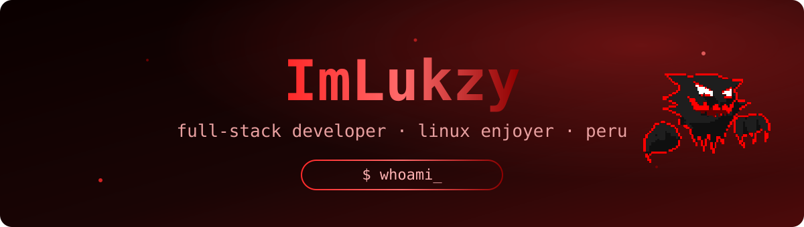

<div align="center">




</div>

## about

```py
lukas = {
    "role": "full-stack developer & systems student @ Tecsup",
    "focus": ["web apps", "apis", "databases", "linux ricing"],
    "stack": ["TypeScript", "Python", "Java", "Go"],
    "daily_driver": "CachyOS + Hyprland (HyDE)",
    "contact": "lukas.melgar@tecsup.edu.pe",
}
```

## core skills

<div align="center">

[](https://skillicons.dev)

</div>

## stats

<div align="center">


</div>

## featured

| | |
|---|---|
| [**ReservaYa.site**](https://github.com/ImLukzy/ReservaYa.site) — reservas full-stack (Astro + Next.js API) | [**portafolio-fullstack**](https://github.com/ImLukzy/portafolio-fullstack) — portafolio personal con CMS |
| [**UniversoAgustino**](https://github.com/ImLukzy/UniversoAgustino) | [**tecsup_community**](https://github.com/ImLukzy/tecsup_community) |

<div align="center">


</div>
